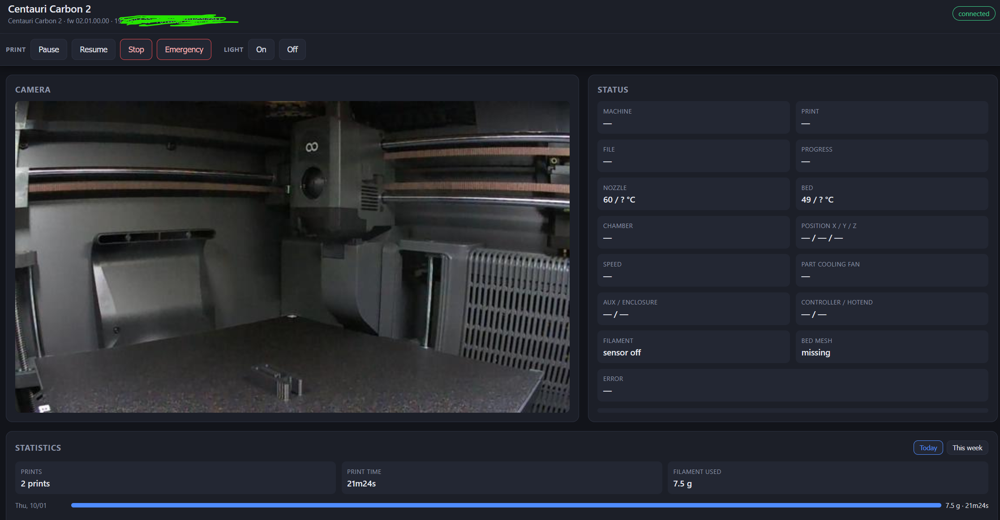
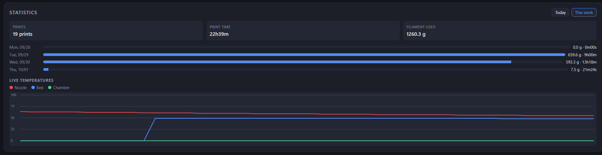
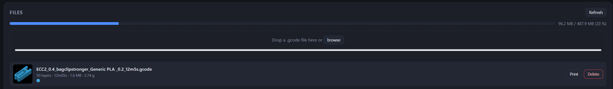
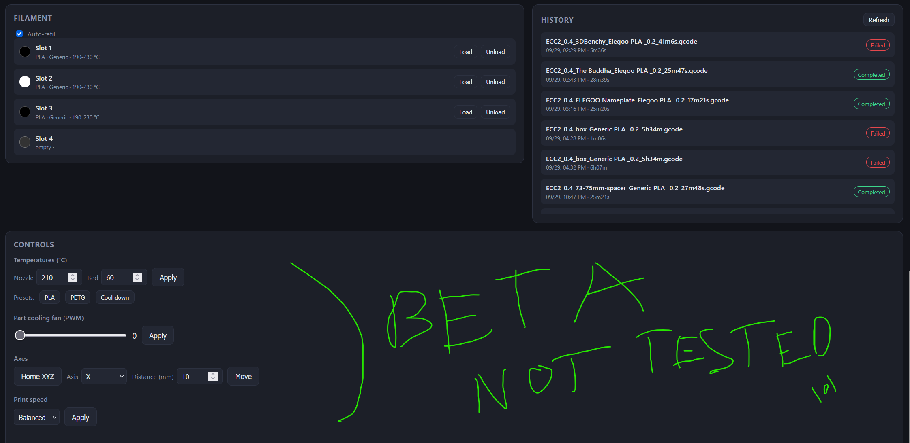

# CC2 Open Local UI

A local web UI for the **Elegoo Centauri Carbon 2** (CC2) printer. It talks to the
printer's local API and gives you the camera feed, live status, file management,
filament control, statistics and print controls in the browser — no cloud, no
Elegoo account.



> **Status: beta, not fully tested.** The interface works against stock CC2
> firmware, but some features (file upload, filament operations) should be used
> with care.

## Why a server in the middle

The bundled Python server handles the awkward parts of the printer's API:

- It keeps a **single MQTT connection** alive (registration, heartbeat, merging
  state deltas) instead of one connection per browser tab.
- It opens **one camera stream** and fans it out to every client, sidestepping
  CORS and the printer's client limit.
- It serves the static page and a small REST API, and proxies G-code uploads so
  the browser never needs to talk to the printer directly.

## Features

- **Camera** — proxied MJPEG stream, multiple viewers supported.
- **Live status** — machine state, file, progress, nozzle/bed/chamber
  temperatures, X/Y/Z position, speed, all fans, filament sensor, bed mesh and
  decoded error codes. Refreshed every 2 s.
- **Print controls** in a sticky top bar — Pause, Resume, Stop, Emergency and
  Light, always within reach.
- **Files** — list with thumbnails, layer count, print time, size and filament;
  storage gauge; **drag-and-drop `.gcode` upload**; launch a print with a
  **filament picker** per colour; delete files.
- **Filament / Canvas** — the four slots (1–4) with colour, type and
  temperature range, plus **Load / Unload** and auto-refill.
- **History** — recent jobs with date, duration, status and timelapse link.
- **Statistics** — prints, print time and filament used for **Today** or **This
  week**, a per-day breakdown, and a **live temperature chart**
  (nozzle / bed / chamber).
- **Controls** — nozzle/bed temperatures with presets, part-cooling fan (PWM),
  Home XYZ, axis jog and print speed mode.

<table>
<tr>
<td width="50%"></td>
<td width="50%"></td>
</tr>
<tr>
<td colspan="2"></td>
</tr>
</table>

## Architecture

- **Backend** — Flask + `paho-mqtt` + `requests` (see `app/`).
- **Frontend** — vanilla HTML/CSS/JS, no build step, no external libraries.
- **Transport** — MQTT to the printer on `:1883`; MJPEG camera on `:8080`;
  G-code upload via HTTP `PUT :80/upload`.

```
Browser ──HTTP──> Flask server ──MQTT──────> Printer :1883  (status, commands)
                        │      ──HTTP GET──> Printer :8080  (MJPEG camera)
                        └────────HTTP PUT──> Printer :80    (G-code upload)
```

---

## 1. Requirements

- Docker + Docker Compose (or Python 3.11+ to run without Docker).
- The printer reachable on your LAN, with LAN mode enabled (`lan_status = 1`).
- Its network details:
  - IP address (e.g. `192.168.1.100`);
  - serial number / SN (e.g. `F01W2X3Y4Z5A6B`), shown by the UDP discovery
    response or method `1001`;
  - MQTT password: `123456` by default in LAN mode (`token_status = 0`).

### 1.1 Finding the IP and SN in one command

The printer answers a UDP discovery request on port `52700`
(`{"id":0,"method":7000}`). The reply contains the IP, SN and model.

**Simplest case — you already know the IP: unicast.**

```bash
python3 - <<'PY'
import socket, json
IP = "192.168.1.100"           # <-- your printer's IP
s = socket.socket(socket.AF_INET, socket.SOCK_DGRAM)
s.settimeout(5)
s.sendto(b'{"id":0,"method":7000}', (IP, 52700))
try:
    while True:
        data, addr = s.recvfrom(4096)
        try:
            obj = json.loads(data)
        except ValueError:
            continue
        info = obj.get("result", obj)
        if "sn" in info:
            print(f"IP: {addr[0]}  SN: {info['sn']}  model: {info.get('machine_model')}")
            break
        print("ignored reply:", obj)
except socket.timeout:
    print("no reply — check IP, LAN mode, and firewall")
PY
```

Example output:

```
IP: 192.168.1.100 SN: F01W2X3Y4Z5A6B model: Centauri Carbon 2
```

Copy the `SN` value into `PRINTER_SN` (and the IP into `PRINTER_IP`).

> **Under WSL2 (NAT networking)** the `255.255.255.255` broadcast does not leave
> the VM, so discovery fails (you only see the echo of your own `{'id': 0,
> 'method': 7000}` request). Use the **unicast** version above, or run discovery
> from Windows PowerShell:

```powershell
$u = New-Object System.Net.Sockets.UdpClient
$u.EnableBroadcast = $true
$u.Client.ReceiveTimeout = 5000
$m = [Text.Encoding]::ASCII.GetBytes('{"id":0,"method":7000}')
$u.Send($m, $m.Length, '255.255.255.255', 52700) | Out-Null
try {
  $ep = New-Object System.Net.IPEndPoint([System.Net.IPAddress]::Any, 0)
  $d = $u.Receive([ref]$ep)
  "IP: $($ep.Address)"
  [Text.Encoding]::ASCII.GetString($d)
} catch { "no reply (timeout)" }
```

> WSL2 alternative: switch to "mirrored" networking (Windows 11 22H2+) by adding
> `networkingMode=mirrored` under `[wsl2]` in `%UserProfile%\.wslconfig`, then run
> `wsl --shutdown`.

---

## 2. Configuration

Everything is configured through **environment variables**, set in
`docker-compose.yml` (or passed with `-e` to `docker run`).

| Variable | Default | Description |
|----------|---------|-------------|
| `PRINTER_IP` | `192.168.1.100` | Printer IP address. |
| `MQTT_PORT` | `1883` | Port of the embedded MQTT broker. |
| `PRINTER_SN` | `F01W2X3Y4Z5A6B` | Printer serial number (SN). |
| `MQTT_USER` | `elegoo` | MQTT username. |
| `MQTT_PASS` | `123456` | MQTT password (LAN mode) — also used as the upload token. |
| `CLIENT_ID` | `ecc2_ui` | MQTT client ID base name (a short random suffix is appended per run). |
| `CAMERA_URL` | `http://<PRINTER_IP>:8080/?action=stream` | MJPEG stream URL. |
| `WEB_HOST` | `0.0.0.0` | Web server listen address. |
| `WEB_PORT` | `8080` | Web server port inside the container. |
| `HEARTBEAT_INTERVAL` | `15` | MQTT heartbeat interval in seconds (10–30 recommended). |
| `COMMAND_TIMEOUT` | `10` | Max wait for a command reply, in seconds. |

Example `docker-compose.yml` to adapt:

```yaml
services:
  cc2-ui:
    build: .
    image: cc2-open-local-ui
    container_name: cc2-ui
    ports:
      - "8080:8080"
    environment:
      PRINTER_IP: "192.168.1.100"
      MQTT_PORT: "1883"
      PRINTER_SN: "F01W2X3Y4Z5A6B"
      MQTT_USER: "elegoo"
      MQTT_PASS: "123456"
      CLIENT_ID: "ecc2_ui"
    restart: unless-stopped
```

> At minimum, set `PRINTER_IP` and `PRINTER_SN` to match your printer.

---

## 3. Building the image

From the project root:

```bash
docker build -t cc2-open-local-ui .
```

Or through Compose (build + start):

```bash
docker compose build
```

---

## 4. Running

### With Docker Compose (recommended)

```bash
docker compose up -d
```

Then open **http://localhost:8080**.

Logs:

```bash
docker compose logs -f
```

Stop:

```bash
docker compose down
```

### With `docker run`

```bash
docker run -d \
  --name cc2-ui \
  -p 8080:8080 \
  -e PRINTER_IP="192.168.1.100" \
  -e PRINTER_SN="F01W2X3Y4Z5A6B" \
  cc2-open-local-ui
```

### Without Docker

```bash
python -m venv .venv
source .venv/bin/activate        # Windows: .venv\Scripts\activate
pip install -r requirements.txt

export PRINTER_IP="192.168.1.100"
export PRINTER_SN="F01W2X3Y4Z5A6B"
python -m app.server
```

The UI is served at `http://localhost:8080`.

---

## 5. Usage

- **Top bar** — Pause / Resume / Stop / Emergency and Light On/Off. Stop and
  Emergency ask for confirmation.
- **Files** — drag a `.gcode` onto the upload area (or `browse`). Click
  **Print** to open the filament picker, choose the spool per colour, then
  **Start**. **Delete** removes a file from internal storage.
- **Filament** — Load / Unload per slot (1–4) and the auto-refill toggle.
- **Statistics** — switch between **Today** and **This week**; the chart shows
  live nozzle / bed / chamber temperatures.
- **Controls** — temperatures, part-cooling fan (PWM 0–255), Home XYZ, axis jog
  and print speed (Silent / Balanced / Sport / Frenzy).

Print control methods: Pause `1021`, Resume `1023`, Stop `1022`, Emergency
`1007`, Light `1029`, temperatures `1028`, fan `1030`, Home `1026`, move `1027`,
speed `1031`, start `1020`, delete `1047`.

---

## 6. Exposed REST API

| Method | Route | Description |
|--------|-------|-------------|
| `GET` | `/` | Web page. |
| `GET` | `/api/status` | Merged state + `connected`, `registered`, `camera` flags. |
| `GET` | `/api/stream` | Proxied MJPEG stream (fan-out). |
| `GET` | `/api/info` | Printer attributes (model, firmware, SN, IP). |
| `GET` | `/api/files` | File list + internal storage usage. |
| `GET` | `/api/files/thumbnail?name=…` | File thumbnail (PNG). |
| `GET` | `/api/history` | Print history. |
| `GET` | `/api/filament` | Canvas / filament slots. |
| `GET` | `/api/stats?period=today\|week&tz=<offset>` | Aggregated statistics. |
| `POST` | `/api/upload` | Multipart `file` → forwarded to the printer. |
| `POST` | `/api/command` | Body `{"method": <code>, "params": {...}}`. Only allow-listed methods. |

---

## 7. Networking corner cases

- **Access from another machine on the LAN**: replace `localhost` with the IP of
  the Docker host (e.g. `http://192.168.1.200:8080`).
- **UDP discovery (port 52700)**: not used by the UI (the IP is set in config).
  No need to open this port.
- **`network_mode: host`** (Linux only): useful to let the container share the
  host network directly. In that case, drop the `ports:` section and leave
  `WEB_PORT` unchanged.

---

## 8. Troubleshooting

| Symptom | Likely cause / fix |
|---------|--------------------|
| "disconnected" badge | Wrong `PRINTER_IP`/`PRINTER_SN`, or printer offline. Check `docker compose logs -f`. |
| "connecting…" badge stuck | MQTT connected but not registered: wrong SN, or too many MQTT clients (ElegooSlicer/Orca). Close a concurrent client. Each run uses a unique client ID, so restarts don't get stuck on "already registered". |
| Camera "stream unavailable" | Wrong `CAMERA_URL`, or no camera detected (`external_device.camera = false`). |
| Upload fails | Ensure the file is a real `.gcode` and the printer is on stock firmware (HTTP `PUT :80/upload`). |
| Filament shows 0 g | The file was deleted, so its per-file usage can't be matched. |
| Command refused (error `1009`) | Printer busy (`PrinterBusy`). |
| Command refused (`1010`) | Operation not allowed while not printing (`PrinterNotPrinting`). |
| Control lost after a minute | Heartbeat interrupted: make sure the container isn't paused and keep `HEARTBEAT_INTERVAL` ≤ 30 s. |

---

## 9. Security and limitations

- The printer's local API has **no strong authentication**; this UI is meant for a
  **trusted local network**. Do not expose it to the internet.
- The web server uses Flask's development server (`threaded=True`), which is fine
  locally; for heavier use, switch to Gunicorn (`--worker-class gthread`).
- **Statistics**: filament usage is derived from each file's metadata and matched
  by filename — a deleted file loses its usage figure. "Today"/"This week" follow
  the **browser's timezone**.
- **Stock firmware**: extended HTTP file APIs are not available, so G-code
  **download** (and 3D preview of a stored file) is not possible. Uploads are the
  only file transfer.
- The **live temperature chart** is kept in the browser and resets on reload.
